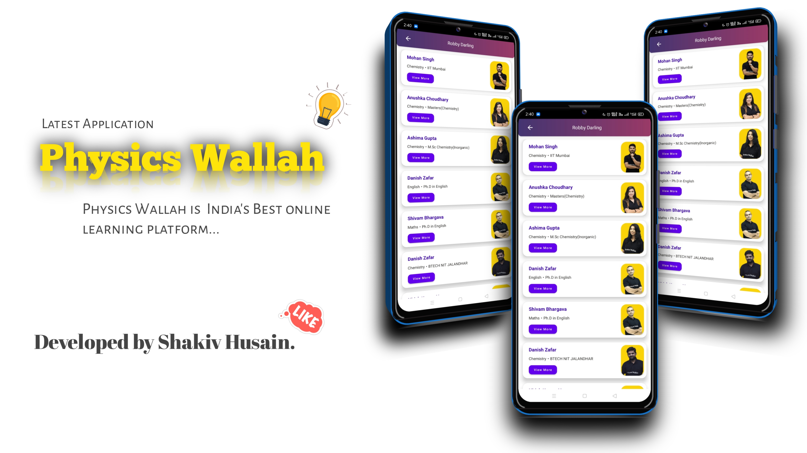
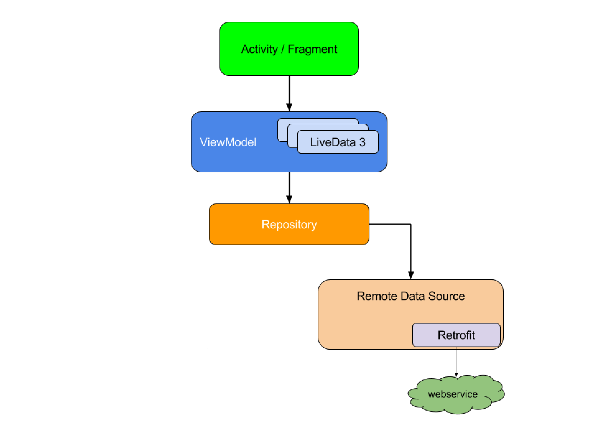

# Physic Wallah 🎓

'Physics Wallah', is India's Best online learning platform. The most affordable learning platform that cares about you.

## Built With 🛠

- [ViewBinding](https://developer.android.com/topic/libraries/view-binding) - Generates a binding class for each XML layout file present in that module and allows you to more easily write code that interacts with views.
- [LiveData](https://developer.android.com/topic/libraries/architecture/livedata) - Data objects that notify views when the underlying database changes.
- [Retrofit](https://square.github.io/retrofit/) - A type-safe HTTP client for Android and Java.
- [ViewModel](https://developer.android.com/topic/libraries/architecture/viewmodel) - Stores UI-related data that isn't destroyed on UI changes.
- [Android Architecture Components](https://developer.android.com/topic/libraries/architecture) - Collection of libraries that help you design robust, testable, and maintainable apps.
- [Material Components for Android](https://github.com/material-components/material-components-android) - Modular and customizable Material Design UI components for Android.

## Download 📥
- Download latest APK from [Click Here](https://i.diawi.com/eokeB2)

## Screenshots 📷 


## Architecture 🗼

This project follows the famous MVVM architecture and best practices from Google's 
[GithubBrowserSample](https://github.com/android/architecture-components-samples/tree/master/GithubBrowserSample)


## Project Structure 📂

```
.
├── data
|   |
|   ├── api
|   |   ├── constants
|   |   |            └── ApiConstants.java
|   |   └── network
|   |              ├── ApiClient.java
|   |              └──  ApiServices.java
│   ├── model
│   │   ├── User.java
│   └── repository
│       └── UserRepository.java
├── ui
│   ├── adapter
│   |   ├── UserAdapter.java
│   ├── fragment
│   |   ├── HomeFragment.java
│   ├── activities
│   |   └── MainActivity.java
│   ├── viewmodel
│   |   ├── AppViewModel.java
└── utils
        └── AppConstant.java 
    
```

## Requirements 🎯 
- Android 6.0 and Above
- Min sdk version 23

## Permissions 💻
- Internet

